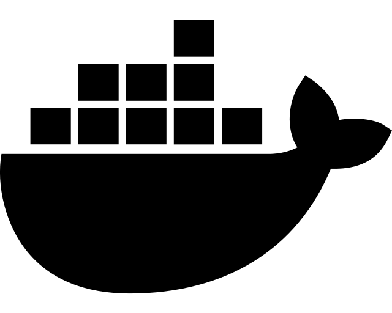

I'm a Software Engineer based in Australia.

I received a Master of Professional Electrical Engineering from The University of Western Australia in 2019, but with *some* hard work (and a lot of luck), I was given numerous opportunities in data analysis and software development.

A few years later, I find myself with a lot of experience in **Web Development** (Back-end, DevOps) and **Data Analytics**, and some fairly strong mathematical/engineering skills to back it all up.

## Interests

## Skills

## Experience

## Outside of work

I do my best to keep fit; my go-to activities are boxing and cycling, but I try to squeeze in some rock climbing and tennis where I can (it's been a while...)

At home, I spend my free time reading and working on skills I won't normally get the chance to; lately, I'm learning:

- Piano
- Modern history (post WW2)

<!--% caption="test" %-->
<!--% src="https://thenounproject.com/icon/docker-4112448/" %-->

    Hello world
    this is second line for asd asdsqqq

<!--  -->

!quote{
    Test some quote
}
<!--% src="hello world" %-->
<!--% author="FDR" %-->